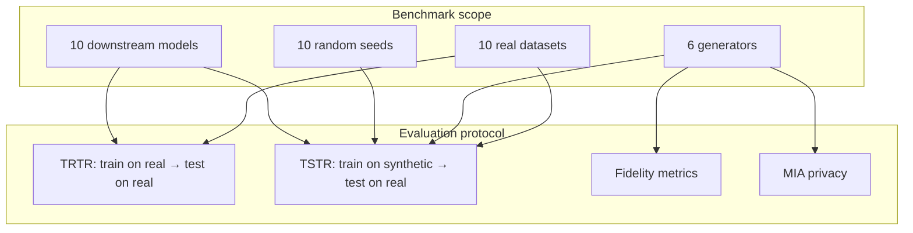
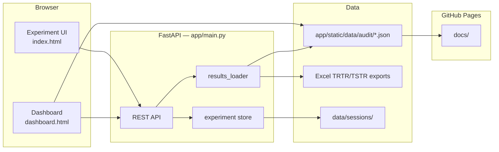
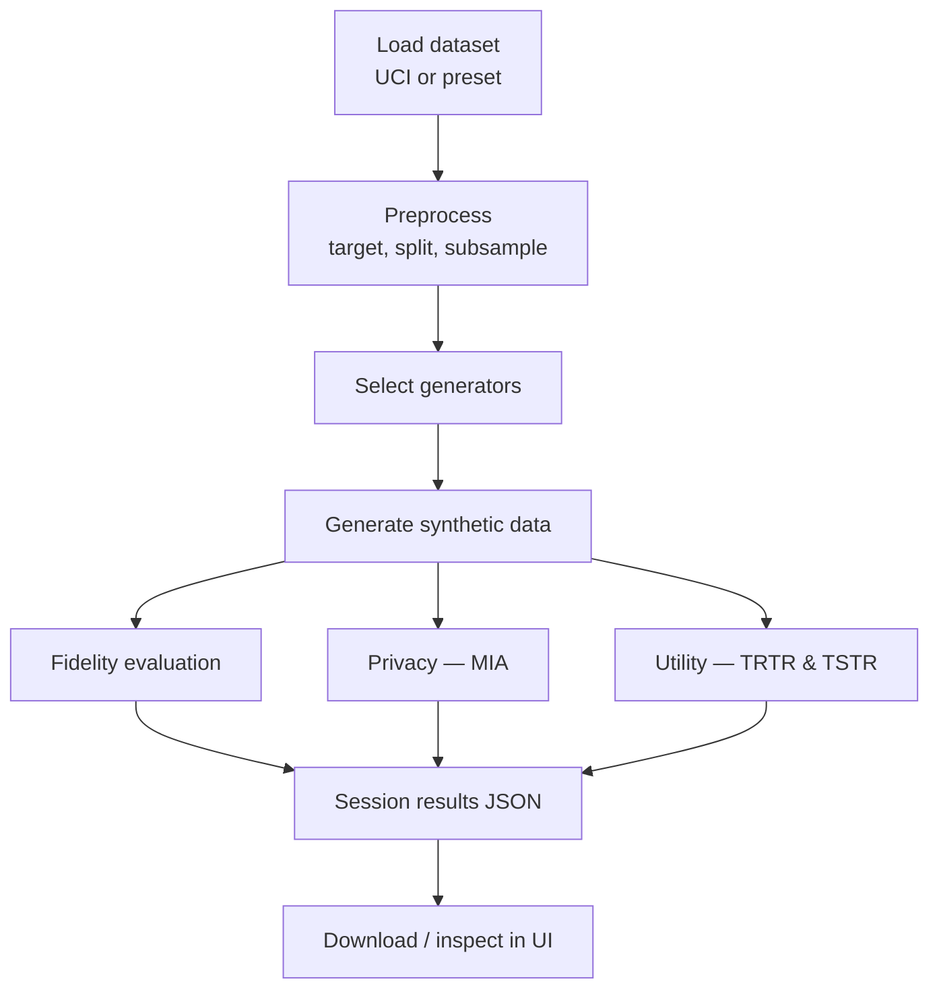
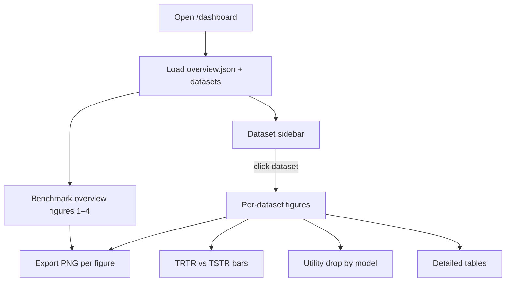

# SYNTH Data Audit — TRTR/TSTR Benchmark Dashboard

Interactive web application and publication dashboard for benchmarking **synthetic data generators** using **fidelity**, **privacy**, and **utility** metrics. Built for the SYNTH experimental setup (10 datasets × 6 generators × 10 seeds × 10 downstream models).

**Live demo (GitHub Pages):** [https://gopibattineni.github.io/webapp_dashboard/](https://gopibattineni.github.io/webapp_dashboard/)

---

## Table of contents

1. [Overview](#overview)
2. [Benchmark design](#benchmark-design)
3. [System architecture](#system-architecture)
4. [Experiment pipeline](#experiment-pipeline)
5. [Dashboard & figures](#dashboard--figures)
6. [Quick start](#quick-start)
7. [Project structure](#project-structure)
8. [API reference](#api-reference)
9. [Scripts](#scripts)
10. [GitHub Pages deployment](#github-pages-deployment)
11. [Data sources](#data-sources)
12. [License](#license)

---

## Overview

This repository provides two complementary interfaces:

| Interface | URL / path | Purpose |
|-----------|------------|---------|
| **Experiment app** | `http://127.0.0.1:8000/` | Run new synthetic-data experiments (load → preprocess → generate → evaluate) |
| **Results dashboard** | `http://127.0.0.1:8000/dashboard` | Explore pre-computed TRTR/TSTR benchmark results with publication-quality figures |
| **Static site** | `docs/` → GitHub Pages | Host the dashboard without a Python server |

### Key capabilities

- **TRTR** (Train on Real, Test on Real) — baseline utility on real data  
- **TSTR** (Train on Synthetic, Test on Real) — utility when training on synthetic data  
- **Fidelity** — KS complement, TV complement, correlation similarity, JS divergence, Wasserstein distance  
- **Privacy** — Membership Inference Attack (MIA)  
- **Publication figures** — heatmaps, CD diagrams, gap plots, scatter plots, boxplots (PNG/PDF at 300 DPI)

---

## Benchmark design



### Datasets (10)

| ID | Name | Task |
|----|------|------|
| `cancer` | Breast Cancer Wisconsin | Classification |
| `magic` | MAGIC Gamma Telescope | Classification |
| `adult` | Adult Census | Classification |
| `forest_cover` | Forest Cover Type | Classification |
| `bank` | Bank Marketing | Classification |
| `wine` | Wine Quality | Classification |
| `mushroom` | Secondary Mushroom | Classification |
| `cdc_diabetes` | CDC Diabetes | Classification |
| `metro` | Metro Interstate Traffic | Regression |
| `online_shopping` | Online Shopping | Regression |

### Generators (6)

| Generator | Library / method |
|-----------|------------------|
| CTGAN | SDV |
| CopulaGAN | SDV |
| TVAE | SDV |
| GaussianCopula | SDV |
| WGAN-GP | Custom |
| CTABGAN | Custom |

---

## System architecture



---

## Experiment pipeline

Use the **Experiment app** (`/`) to run a full audit on a new dataset.



### Evaluation metrics

| Category | Metrics |
|----------|---------|
| **Utility (classification)** | Accuracy, F1, Precision, Recall + TRTR/TSTR drops |
| **Utility (regression)** | R², RMSE, MAE, MSE + TRTR/TSTR drops |
| **Fidelity** | KS complement, TV complement, correlation similarity, JS divergence, Wasserstein |
| **Privacy** | MIA attack accuracy |

---

## Dashboard & figures

The **Results dashboard** (`/dashboard`) visualises pre-computed benchmark results.

### Benchmark overview (all datasets)

| Figure | Description |
|--------|-------------|
| **Fig. 1** | Critical Difference diagram (Friedman + Nemenyi post-hoc) |
| **Fig. 2** | Mean TSTR performance per generator ± SD |
| **Fig. 3** | TRTR − TSTR utility gap per generator |
| **Fig. 4** | TSTR heatmap (dataset × generator) |
| **Supplementary** | Utility-loss heatmaps (classification & regression), win-rate chart |

### Per-dataset figures (select a dataset in the sidebar)

| Figure | Description |
|--------|-------------|
| **TRTR vs TSTR** | Grouped bar chart (mean over 10 downstream models) |
| **Utility drop by model** | Horizontal bar chart for one generator (TRTR − TSTR per classifier) |
| **Radar chart** | Multi-metric utility drop |
| **Tables** | TRTR baseline, generator summary, all comparisons |



### Paper figure generation (Python)

Generate all manuscript figures from a long-format CSV:

```bash
pip install pandas numpy matplotlib seaborn scipy scikit-posthocs
python scripts/generate_paper_figures.py --input results.csv
```

Output: `paper_figures/fig01` … `fig07` (PNG + PDF, 300 DPI).

**Recommended manuscript placement:**

| Main paper | Supplementary |
|------------|---------------|
| Fig. 1 CD diagram | Fig. 5 Fidelity vs utility |
| Fig. 2 Mean TSTR ± SD | Fig. 6 Privacy vs utility |
| Fig. 3 TRTR–TSTR gap | Fig. 7 Seed boxplots |
| Fig. 4 TSTR heatmap | Utility-loss heatmaps, win-rate |

---

## Quick start

### Prerequisites

- Python 3.10+
- pip

### Install

```bash
git clone https://github.com/gopibattineni/webapp_dashboard.git
cd webapp_dashboard
pip install -r requirements.txt
```

For paper figures only:

```bash
pip install matplotlib seaborn scikit-posthocs
```

### Run locally

**Option A — double-click (Windows)**

```
start.bat
```

**Option B — command line**

```bash
python -m uvicorn app.main:app --host 127.0.0.1 --port 8000 --reload
```

Then open:

| Page | URL |
|------|-----|
| Experiment app | http://127.0.0.1:8000/ |
| Results dashboard | http://127.0.0.1:8000/dashboard |

> Keep the terminal open while using the app. If you see `ERR_CONNECTION_REFUSED`, the server is not running.

### Export audit data to JSON

```bash
python scripts/export_dashboard_data.py
```

Writes to `app/static/data/audit/` (used by the dashboard and GitHub Pages).

### Build static site for GitHub Pages

```bash
python scripts/build_github_pages.py
```

Copies dashboard assets into `docs/` with correct base paths.

---

## Project structure

```
webapp_dashboard/
├── app/
│   ├── main.py                 # FastAPI entry point
│   ├── schemas.py              # Request/response models
│   ├── pipeline/
│   │   ├── experiment.py       # Session store & experiment orchestration
│   │   ├── results_loader.py   # Load Excel/JSON audit results
│   │   ├── generators.py       # Synthetic data generators
│   │   ├── fidelity.py         # Fidelity metrics
│   │   ├── privacy.py          # MIA privacy evaluation
│   │   ├── utility.py          # TRTR/TSTR utility evaluation
│   │   └── ...
│   └── static/
│       ├── index.html          # Experiment UI
│       ├── dashboard.html      # Results dashboard
│       ├── dashboard.js        # Dashboard logic
│       ├── dashboard-charts.js # Chart.js figure renderers
│       └── data/audit/         # Exported JSON results
├── docs/                       # GitHub Pages static site
├── scripts/
│   ├── export_dashboard_data.py
│   ├── build_github_pages.py
│   └── generate_paper_figures.py
├── paper_figures/              # Generated publication figures
├── data/sessions/              # Live experiment session outputs
├── requirements.txt
├── start.bat
└── README.md
```

---

## API reference

### Results dashboard

| Method | Endpoint | Description |
|--------|----------|-------------|
| `GET` | `/api/results/datasets` | List benchmark datasets |
| `GET` | `/api/results/datasets/{id}` | Full results for one dataset |
| `GET` | `/api/results/overview` | Cross-dataset aggregates (heatmaps, CD, rankings) |

### Live experiments

| Method | Endpoint | Description |
|--------|----------|-------------|
| `POST` | `/api/session` | Create session |
| `POST` | `/api/load` | Load UCI / preset dataset |
| `POST` | `/api/preprocess` | Preprocess data |
| `POST` | `/api/experiment` | Start experiment (async) |
| `GET` | `/api/experiment/{id}/status` | Poll progress |
| `GET` | `/api/experiment/{id}/results` | Fetch results |
| `GET` | `/api/datasets/presets` | List dataset presets |

---

## Scripts

| Script | Command | Purpose |
|--------|---------|---------|
| Export JSON | `python scripts/export_dashboard_data.py` | Excel → `app/static/data/audit/` |
| Build Pages | `python scripts/build_github_pages.py` | Build `docs/` for GitHub Pages |
| Paper figures | `python scripts/generate_paper_figures.py [--input CSV]` | Generate fig01–fig07 |

### CSV format for paper figures

Required columns:

```
dataset, generator, seed, classifier, metric,
trtr_score, tstr_score, fidelity_score, mia_score
```

---

## GitHub Pages deployment


### Setup (one-time)

1. Open **Settings → Pages** on GitHub  
2. **Source:** Deploy from a branch  
3. Choose **one** of these (recommended first):

| Option | Branch | Folder | Notes |
|--------|--------|--------|--------|
| **Recommended** | `main` | `/docs` | Serves `docs/index.html` at the site root |
| Alternative | `gh-pages` | `/(root)` | Filled by GitHub Actions on each push to `main` |

**Do not** use `main` / `(root)` unless you have pushed the root `index.html` redirect — otherwise GitHub shows **README.md** instead of the dashboard.

After changing the setting, wait 1–2 minutes and hard-refresh (`Ctrl+F5`).

### Push updates

```bash
git add .
git commit -m "Update dashboard"
git push origin main
```

The workflow in `.github/workflows/deploy-dashboard.yml` publishes the `docs/` folder automatically on push to `main`.

---

## Data sources

Pre-computed TRTR/TSTR results are loaded from:

1. **Primary:** Excel exports under  
   `Synthetic_Data_Audit/SYNTH/Single run_Data_leak_Synth_Quality/`  
   (sibling folder to this repo on the original development machine)

2. **Fallback:** JSON in `app/static/data/audit/`  
   (bundled with the repo — used when Excel files are not present)

To point at your own Excel exports, place them in the expected folder structure or re-export:

```bash
python scripts/export_dashboard_data.py
```

---

## License

MIT License — see [LICENSE](LICENSE).  
Copyright (c) 2026 Gopi Battineni.

---

## Citation

If you use this dashboard or benchmark in academic work, please cite the SYNTH synthetic data audit study and acknowledge:

- **LERO** — Irish Software Research Centre  
- **BDS** — Business Data Science group  

---

## Troubleshooting

| Problem | Solution |
|---------|----------|
| `ERR_CONNECTION_REFUSED` on localhost | Run `start.bat` or `uvicorn` (see [Quick start](#quick-start)) |
| Dashboard shows no datasets | Run `python scripts/export_dashboard_data.py` |
| GitHub Pages shows README, not graphs | Set Pages to **`main` / `docs`** (or `gh-pages` / root), then push latest `docs/` |
| GitHub Pages 404 | Enable Pages (see [GitHub Pages deployment](#github-pages-deployment)) |
| Figures look stale | Hard-refresh with `Ctrl+F5` |
| Friedman/CD diagram empty | Need ≥3 datasets with complete generator data |
